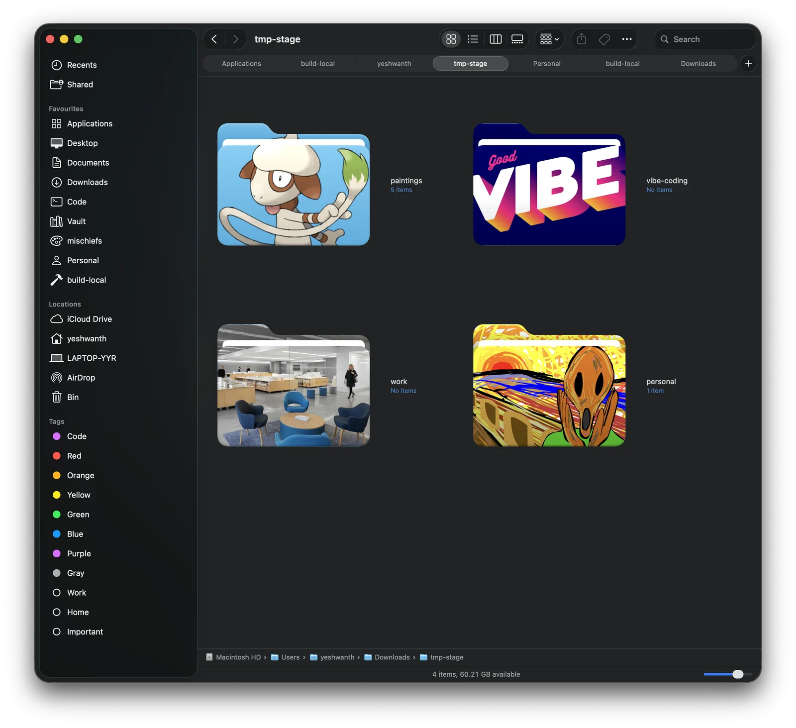
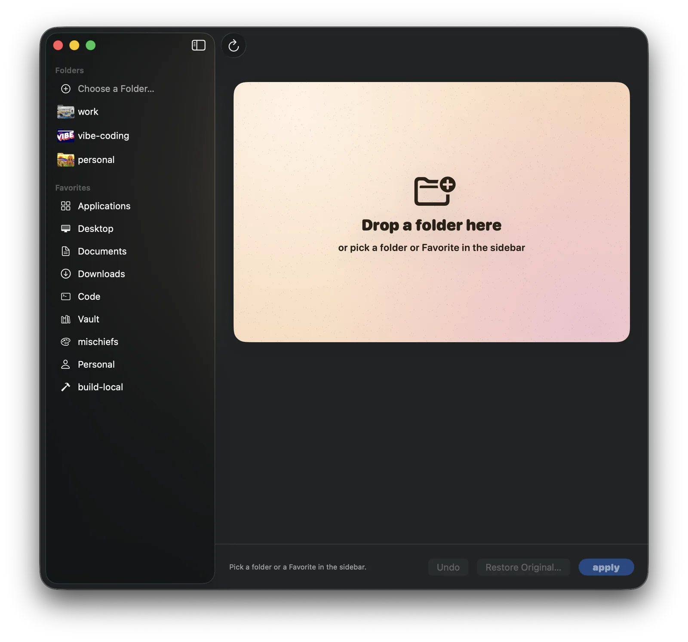
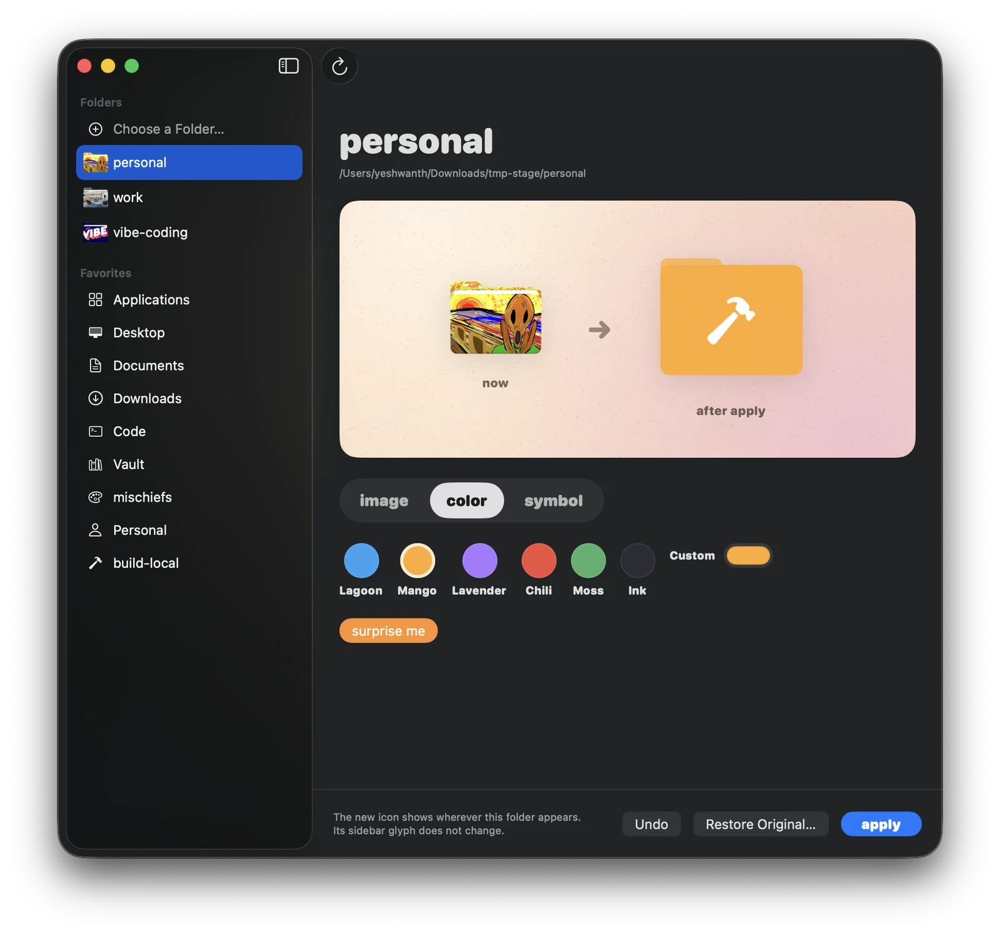
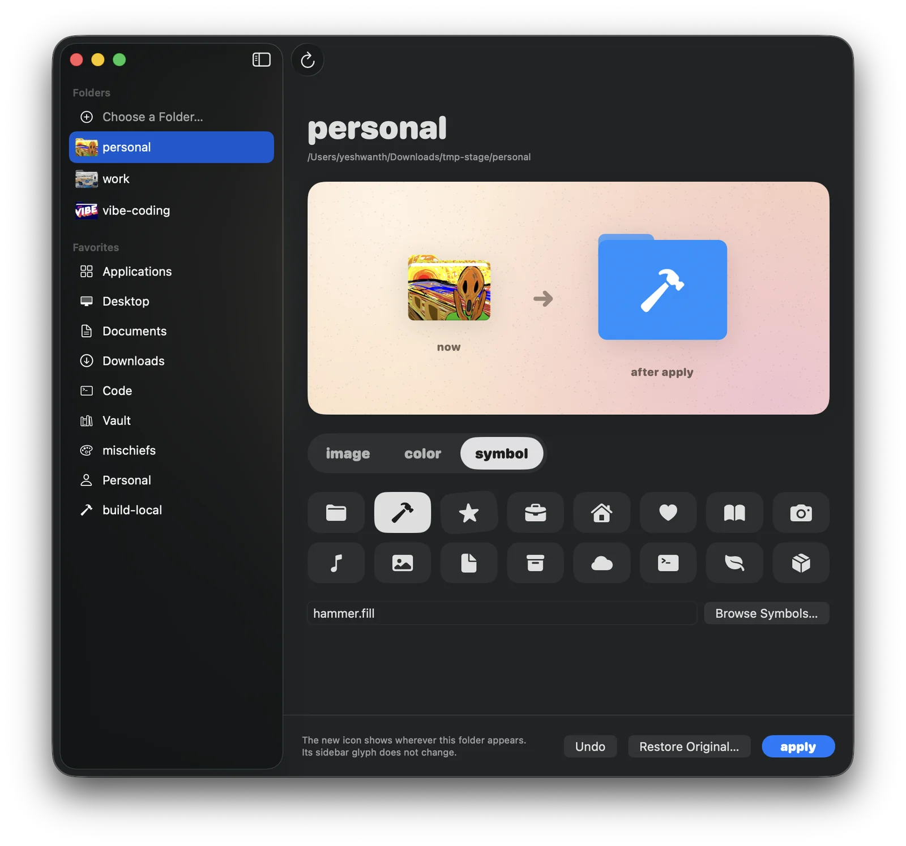
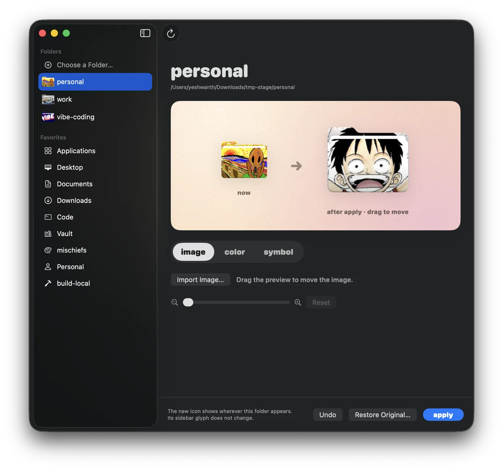
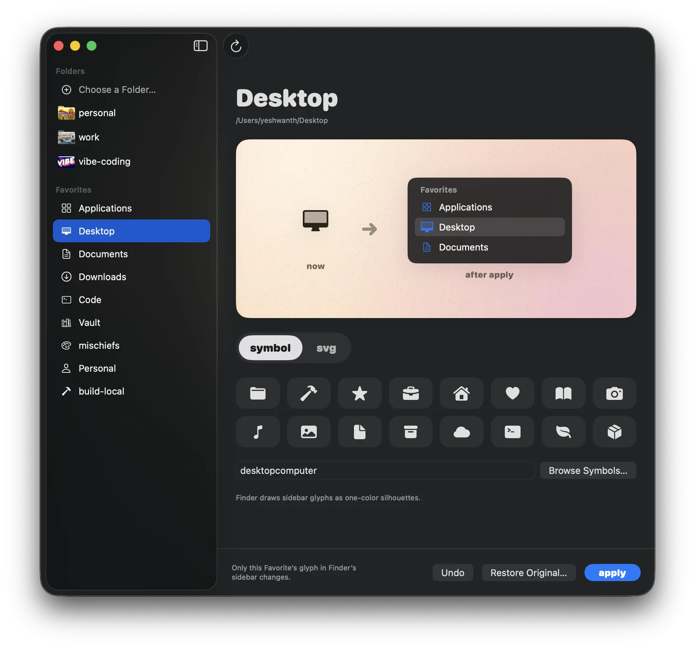
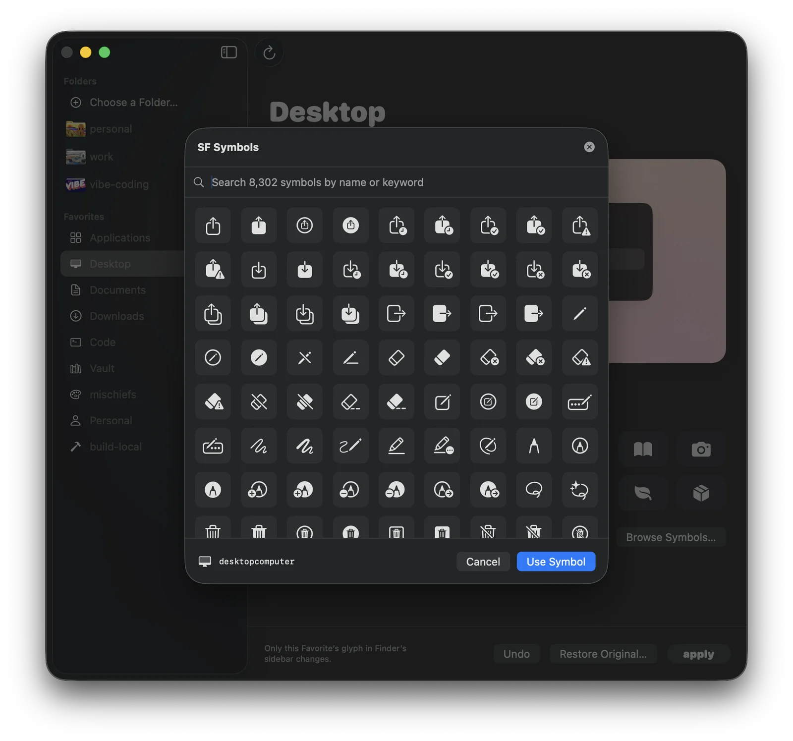

# Roopam

Roopam (रूपम्, "form, appearance"; said *ROO-pum*) changes how folders look in macOS Finder. It edits two things independently: a folder's own icon, which shows in Finder windows, on the Desktop and in the Dock, and the glyph on the folder's row in Finder's Favorites sidebar.




## What it does

- **Folder icons:** a colored folder with an SF Symbol on it, or your own image painted onto the macOS folder shape.
- **Sidebar glyphs:** a one-color SF Symbol or imported SVG on an existing Favorite's row.
- **Both at once:** a folder can keep its own icon and its sidebar glyph. Roopam sets up a small Finder extension for that folder.
- **Undo and Restore Original:** every change is recorded, so you can step back once or return to the icon the folder had before Roopam first changed it.

Roopam's sidebar mirrors Finder's. Pick a folder under **Folders** to change its icon, or a Favorite under **Favorites** to change its sidebar glyph. The preview stage shows the icon now and after Apply. Folder icons and sidebar glyphs keep separate drafts, and Apply changes only the one you are editing.



## Folder icons

Click **Choose a Folder…**, drop a folder onto the sidebar or the stage, or pick a recent folder under **Folders**. Then choose the artwork with the **image**, **color** and **symbol** tabs.

### Color and symbol

On the **color** tab, pick a named swatch (Lagoon, Mango, Lavender, Chili, Moss, Ink) or a custom color. **surprise me** picks a random color and symbol. On the **symbol** tab, click a symbol, type a symbol name, or use **Browse Symbols…** to search every SF Symbol on this Mac.

<p>
  
  
</p>

### Your own image

On the **image** tab, click **Import Image…** and pick a PNG, JPEG or TIFF. Roopam paints the image onto the macOS 26 folder: it covers the back flap and the front flap, keeps the system shading, and leaves the white paper sheet between them.

- **Drag** the preview to move the image on the folder.
- **Pinch** on the trackpad or use the **zoom slider** (100–400%) to scale it.
- **Reset** returns the image to 100%, centered.

The image always covers the whole folder; you cannot drag an edge into view. An imported `.icns` file is treated as a finished icon and used as-is.



## Sidebar glyphs

Pick a Favorite under **Favorites**. Roopam does not add or remove Favorites; add the folder to Finder's sidebar first, then click the refresh button in the toolbar. Favorites Finder cannot find are listed but cannot be edited.

On the **symbol** tab, pick an SF Symbol. On the **svg** tab, import your own artwork; the **Symbol size** slider scales it against the system symbols. Finder draws sidebar glyphs as one-color silhouettes, so color is dropped. The preview draws the Favorite between its neighbours at Finder's sidebar size.





## Keeping both icons

On macOS 26, a folder with its own icon makes Finder redraw its sidebar row from that icon, which removes the sidebar glyph. When a folder has both its own icon and a sidebar glyph, Apply sets up one Finder Sync extension for that folder, which keeps both icons. The editor says when this applies and has an **Open Extension Settings** button. Enable the extension there once.

The extension appears in **System Settings › General › Login Items & Extensions** as `SBF-<folder name>`.

## Undo, restore and Finder restart

- **Undo** restores the appearance immediately before the last change.
- **Restore Original** restores the appearance from before Roopam first changed it. A folder's icon and its sidebar glyph are restored separately.
- **Restart Finder** appears when Finder needs it and asks for confirmation. Roopam never restarts Finder on its own.

History records include the folder's device and inode, so a new folder at the same path does not inherit an old folder's backup.

## Install

1. Download the latest `Roopam-<version>.dmg` from [Releases](https://github.com/sizhky/Roopam/releases).
2. Drag **Roopam** to Applications.
3. Open it. Release builds are ad-hoc signed, not notarized, so macOS blocks the first launch. Open **System Settings › Privacy & Security** and click **Open Anyway**.

Requires macOS 26 (Tahoe) or later on Apple silicon.

## Uninstalling

1. In Roopam, use **Restore Original** on each folder and Favorite you changed.
2. Drag **Roopam** to the Trash.
3. Optionally delete `~/Library/Application Support/Roopam`.

Do step 1 before step 2 if you used both icons. Deleting the app does not unregister its Finder extensions; remove them in System Settings or by deleting the Application Support folder.

## Building from source

Requires macOS 26 and the Xcode command-line tools.

```bash
git clone https://github.com/sizhky/Roopam.git
cd Roopam
make build   # builds build-local/Roopam.app
make test    # recovery, selection and refresh checks
```

### Releasing

1. `make bump PART=patch` (or `minor`, `major`, `X.Y.Z`) sets the version, increments the build number, updates `nix/default.nix`, and adds a CHANGELOG section.
2. Fill in the CHANGELOG section, commit, and push to `main`.
3. `make release` checks the preconditions, builds, runs the checks, signs, packages `Roopam-<version>.dmg`, tags `v<version>`, and publishes a GitHub release with the DMG, its SHA-256, and the CHANGELOG section as notes.

`scripts/build-release.sh` signs with a **Developer ID Application** identity when one is in the keychain and notarizes when a notary keychain profile exists; otherwise it signs ad-hoc. `SIGN_IDENTITY`, `NOTARY_PROFILE` and `NOTARIZE=0` override this.

### Nix (flakes)

```bash
nix run github:sizhky/Roopam
```

This installs the released DMG. After each release, set `hash` in `nix/default.nix` from the published `.sha256` file.

## Roadmap

- AI-generated folder art: describe a folder and get an illustrated icon in the style of the image import.

## Documentation

- [Getting started](START-HERE.md)
- [Folder icon design and acceptance checks](docs/folder-icons/design.md)
- [Architecture](docs/ARCHITECTURE.md)
- [Changelog](CHANGELOG.md)

## Credits

- Based on [SidebarFavorites](https://github.com/ivg-design/SidebarFavorites) by IVG-Design, under the MIT license. Roopam reuses its symbol catalog, SVG pipeline, Finder integration and per-folder helper mechanism.
- Inspired by [rknightuk/custom-finder-sidebar-icons](https://github.com/rknightuk/custom-finder-sidebar-icons).

## License

MIT - see [LICENSE](LICENSE).

This project is not affiliated with Apple Inc. SF Symbols is a trademark of Apple Inc.
